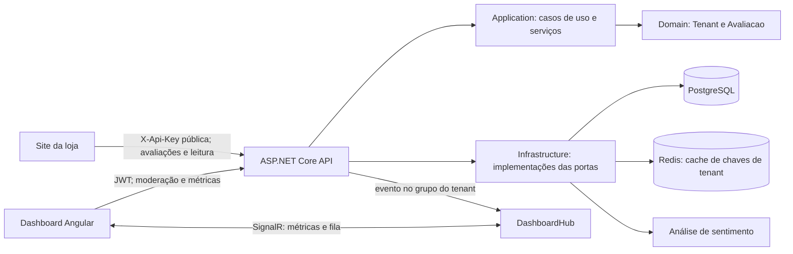

# Arquitetura do RepCortex

Este é o guia de arquitetura para quem desenvolve o RepCortex, incluindo agentes de código. Ele descreve o comportamento observado no repositório e as regras para evoluí-lo. O [README](../README.md) apresenta o produto e os comandos de execução.

## Produto e fluxo atual

O RepCortex é uma plataforma multi-tenant de avaliações para lojas. Cada lojista cadastra um tenant, integra sua loja pela API pública e modera avaliações no dashboard Angular.

1. O cadastro cria o tenant e seu administrador, devolvendo JWT, `publishableKey` e `secretKey`. O cadastro define o tenant no escopo antes das operações de Identity.
2. A loja envia `POST /api/public/avaliacoes` com `X-Api-Key` pública, `usuarioIdExterno`, produto, nota e comentário. `nomeUsuarioExterno` é opcional. O tenant vem da chave autenticada; o IP vem da conexão, não do corpo enviado pelo cliente.
3. `AvaliacaoService` consulta o tenant, analisa o sentimento e cria `Avaliacao`. A política automática aprova somente nota 5 com sentimento positivo; a manual deixa a avaliação pendente.
4. `GET /api/public/avaliacoes` lista apenas avaliações aprovadas do produto e tenant autenticados, com paginação. A resposta pública não expõe a identidade do autor.
5. O administrador usa JWT para consultar métricas, aprovar, rejeitar e responder avaliações. Responder uma avaliação pendente também a aprova.

`ClienteId` permanece na entidade e no banco para dados históricos; novos envios usam `usuarioIdExterno`. O nome do autor é uma cópia do valor informado pela loja, sem consulta ao cadastro de clientes dela.

## Limites dos componentes

| Componente | Responsabilidade | Dependências permitidas |
| --- | --- | --- |
| `backend/RepCortex.Domain` | Entidades, estados e invariantes do negócio. | Nenhum outro projeto RepCortex. |
| `backend/RepCortex.Application` | Casos de uso, serviços, DTOs e portas de persistência, identidade, sentimento e contexto. | Domain. |
| `backend/RepCortex.Infrastructure` | EF Core, PostgreSQL, migrations, Identity, JWT, Redis e análise de sentimento. | Application e Domain. |
| `backend/RepCortex.API` | Controllers, autenticação, políticas HTTP, middleware, SignalR e composição de dependências. | Application e Infrastructure. |
| `frontend/` | Login, cadastro e dashboard Angular; chamadas HTTP e cliente SignalR. | Contratos HTTP e evento do backend. |

A direção é `API → Application ← Infrastructure` e `Application → Domain ← Infrastructure`. Mantenha `HttpContext`, `DbContext`, detalhes de Redis e tipos de transporte fora de Domain e Application. Coloque regras de negócio nas entidades; orquestração e portas na Application; implementação técnica na Infrastructure; tradução HTTP na API. A solução continua um monólito modular: só separe serviços quando existir uma necessidade medida de escala ou operação.

## Contratos e isolamento multi-tenant

- `POST /api/auth/registrar` e `POST /api/auth/login` são públicos; o dashboard usa o JWT retornado. O cadastro devolve a chave secreta uma vez; o frontend não a persiste.
- `GET` e `POST /api/public/avaliacoes` exigem `X-Api-Key` do tipo `publishable`. A API aceita chamadas de sites externos via CORS público sem credenciais; o handler também valida os domínios configurados para cada tenant. CORS, por si só, não é autenticação.
- Rotas `/api/admin/*` e `/hubs/dashboard` exigem JWT de administrador. O CORS do dashboard usa origens explícitas em `Cors:AllowedOrigins` e permite credenciais. Há uma política separada para integração com chave secreta.
- `TenantMiddleware` lê o tenant dos claims após a autenticação e o disponibiliza no escopo da requisição. `TenantService.ObterTenantId()` falha quando ele não foi definido. Os filtros globais do EF Core isolam `Avaliacao` e usuários Identity; as consultas de avaliação também filtram por tenant, e operações por ID verificam a propriedade antes de alterar dados.
- A API aplica rate limit ao endpoint público e ao envio de avaliação de teste do administrador. `TenantRepository` usa Redis para cachear buscas por chaves, com expiração de uma hora e invalidação na atualização do tenant.
- Mudanças no contrato público devem manter o isolamento, não expor dados do autor na listagem pública e considerar consumidores externos. Mudanças de esquema exigem migration em Infrastructure e compatibilidade com registros existentes.

## Operação e verificação

O backend usa .NET 10 e PostgreSQL; o dashboard usa Angular. O `docker-compose.yml` em `backend/` fornece PostgreSQL e Redis locais. `backend/Dockerfile` e `railway.json` definem o build da API; o dashboard é configurado separadamente no Vercel. O backend aplica migrations no ambiente Development ou quando `Database:ApplyMigrations=true`; o arquivo `appsettings.Production.json` versionado habilita essa opção. Verifique sempre a configuração efetiva do ambiente antes de concluir que uma migration foi aplicada em produção.

Para uma nova funcionalidade:

1. Escreva o fluxo e os contratos afetados; determine quem fornece o tenant e qual credencial autoriza cada operação.
2. Implemente invariantes em Domain, orquestração e interfaces em Application, adaptações em Infrastructure e transporte na API; atualize o cliente Angular se o contrato mudar.
3. Crie migration para alterações persistidas, preservando dados históricos. Acrescente testes de regra de negócio, fronteira entre projetos e isolamento entre tenants conforme o risco da mudança.
4. Valide com `dotnet build backend/RepCortex.sln -c Release -warnaserror`, `dotnet test backend/RepCortex.sln -c Release` e, para alterações de API, o smoke HTTP documentado no README. Para alterações do dashboard, execute `npm run build` em `frontend/` e confira o fluxo no navegador.
5. Registre no PR o comportamento testado e qualquer limite ainda não verificado. O fluxo habitual é branch de `develop`, PR para `develop` e promoção posterior para `main`.

O CI do backend compila, executa testes, faz um smoke HTTP com PostgreSQL e Redis e constrói a imagem Docker. O smoke cria dois tenants e verifica isolamento nas consultas e ações. O CI do frontend compila e executa os testes Angular. O Compose de demonstração na raiz sobe API, dashboard, PostgreSQL e Redis com dados locais descartáveis.

## Roadmap arquitetural proposto

Estes itens **não** descrevem capacidades já entregues. Priorize pelo impacto observado ao trabalhar na área:

1. **Medir o desempenho em volumes maiores.** As métricas são agregadas no PostgreSQL e o gráfico cobre os últimos sete dias em UTC. Medir latência e plano de execução antes de adicionar índices específicos ou cache de métricas.
2. **Ampliar a prova de isolamento.** O smoke HTTP já verifica duas lojas, JWT, chaves públicas, ações por ID e listagem. Acrescentar cenários de revogação de chave e domínios autorizados quando esses fluxos evoluírem.
3. **Operar em produção.** Adicionar health checks e telemetria conforme a necessidade operacional medida; não presumir que uma conexão SignalR ativa prove entrega contínua após falhas de infraestrutura.

Revise este guia quando o código ou os contratos mudarem; não apresente itens do roadmap como funcionalidades prontas.
