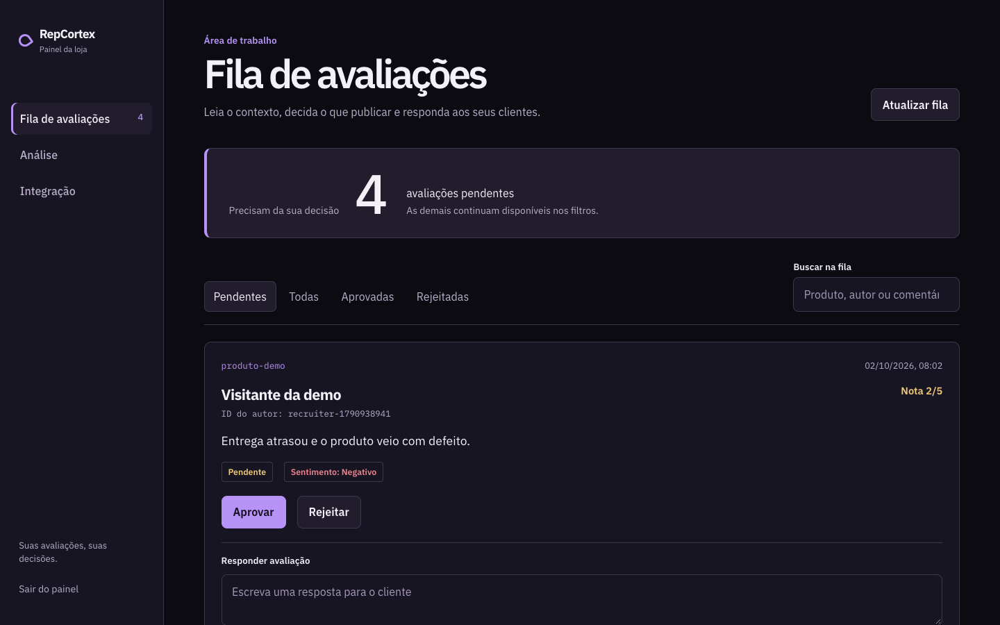

# RepCortex

RepCortex é uma plataforma multi-tenant para donos de e-commerce receberem,
moderarem e publicarem avaliações de produtos. O desenvolvedor integra a API
ao site da loja: visitantes enviam comentários com uma chave pública e o dono
decide o que aparece na página do produto.

[Dashboard publicado](https://repcortex-dashboard.vercel.app/login) ·
[API publicada](https://repcortex-production.up.railway.app/scalar/v1) ·
[Código e versões](https://github.com/GabrielKameoka/RepCortex/releases)



## Demonstração em 2 minutos

Com Docker ativo, execute na raiz do repositório:

```bash
docker compose -f docker-compose.demo.yml up --build
```

Abra [o dashboard local](http://localhost:4200) e entre com a loja `demo-loja`,
e-mail `demo@repcortex.local` e senha `DemoPassword123!`. A base local já tem
avaliações de exemplo. Na aba **Integração**, copie a chave pública e, em outro
terminal, envie uma avaliação como se viesse da loja:

```bash
bash backend/scripts/demo-review.sh rc_pub_SUA_CHAVE
```

A avaliação entra na **Fila** e atualiza os indicadores em tempo real. Responda
ou aprove a avaliação; consulte as publicadas para `produto-demo` pela API
pública usando a mesma chave:

```bash
curl -H 'X-Api-Key: rc_pub_SUA_CHAVE' \
  'http://localhost:5154/api/public/avaliacoes?produtoId=produto-demo'
```

A [referência interativa da API](http://localhost:5154/scalar/v1)
fica disponível durante a demo. Os dados ficam no volume local
`demo-postgres`; este ambiente usa credenciais apenas para demonstração.
Para encerrar, execute `docker compose -f docker-compose.demo.yml down`.

**Roteiro curto:** mostre a fila e as métricas iniciais; envie a avaliação pelo
script; observe a atualização sem recarregar; responda à avaliação; consulte a
listagem pública. O percurso evidencia contrato HTTP, moderação, isolamento do
tenant e atualização via SignalR.

## Fluxo do produto

1. O lojista cria seu espaço; recebe a `secretKey` apenas no cadastro e pode
   consultar a `publishableKey` no painel de integração.
2. O site envia avaliações para `POST /api/public/avaliacoes` usando `x-api-key`.
   Deve informar `usuarioIdExterno` (ID do autor na loja) e pode informar
   `nomeUsuarioExterno` (nome de exibição, até 100 caracteres).
3. O tenant é identificado pela chave; `tenantId` e IP não vêm do cliente.
4. A política automática aprova somente nota 5 com sentimento positivo. A
   política manual mantém toda avaliação como pendente.
5. O site consulta apenas aprovadas em
   `GET /api/public/avaliacoes?produtoId=...&pagina=1&tamanhoPagina=20`.
6. O lojista usa JWT no dashboard para moderar e acompanhar métricas.
   Em cada avaliação ele vê o nome informado pela loja e o ID do autor;
   avaliações antigas ou sem nome mostram `Nome não informado` junto do ID.

O RepCortex não busca o perfil do comprador na loja: o nome é uma cópia do valor
enviado no momento da avaliação. `ClienteId` permanece apenas como coluna
histórica, sem fazer parte dos novos envios. A listagem pública de avaliações
aprovadas não inclui nome nem ID do autor.

## Arquitetura

O [guia de arquitetura](.agents/ARCHITECTURE.md) detalha os fluxos atuais, as
regras para novas funcionalidades e o roadmap arquitetural.

- `frontend/`: projeto Angular do dashboard, com `package.json` e `angular.json`
  na raiz dessa pasta.
- `backend/`: solução `.NET 10` única que contém API, class libraries e testes.
- `backend/RepCortex.Domain`: agregados `Tenant` e `Avaliacao`, entidade `Usuario`,
  enumerações e regras de negócio. Não referencia os outros projetos.
- `backend/RepCortex.Application`: casos de uso, DTOs e portas para persistência,
  transação, identidade e contexto da requisição. Referencia apenas Domain.
- `backend/RepCortex.Infrastructure`: EF Core/PostgreSQL, migrations, Identity, JWT,
  Redis e análise de sentimento. Implementa as portas de Application.
- `backend/RepCortex.API`: controllers, autenticação HTTP, CORS, middleware, SignalR e
  composição das dependências. Referencia Application e Infrastructure.
- `backend/RepCortex.Tests`: testes de domínio, modelo EF e direção das dependências.

As referências entre projetos impõem a direção `API → Application ← Infrastructure`
e `Application → Domain ← Infrastructure`. Controllers delegam operações aos
serviços e casos de uso da aplicação. `AppDbContext` e `HttpContext` permanecem
fora de Application e Domain.

## Configuração local

```bash
cd backend
dotnet restore RepCortex.sln
dotnet build RepCortex.sln -c Release -warnaserror
dotnet test RepCortex.sln -c Release --no-build
```

As migrations e o snapshot existentes pertencem a `RepCortex.Infrastructure`.
Para listar ou criar migrations, use o projeto da API como startup e o de
Infrastructure como destino:

```bash
dotnet ef migrations list --project RepCortex.Infrastructure --startup-project RepCortex.API
dotnet ef migrations add NomeDaMigration --project RepCortex.Infrastructure --startup-project RepCortex.API
```

O workflow `Backend CI` executa build Release sem avisos, testes de unidade e
arquitetura, um fluxo HTTP com PostgreSQL e Redis temporários e o build da
imagem Docker usada pelo Railway. Para repetir o teste HTTP contra uma API
local com dados descartáveis, execute a partir de `backend/`:

```bash
API_BASE_URL=http://localhost:8080 python3 scripts/smoke-backend.py
```

O smoke cria dois tenants e verifica que chaves públicas, consultas e ações
administrativas não atravessam a fronteira entre lojas. O workflow `Frontend CI`
executa build e testes Angular para PRs que alteram `frontend/`.

O Dockerfile da API fica em `backend/Dockerfile`; `railway.json` aponta para
ele com contexto de build na raiz do repositório. O projeto Vercel do dashboard
deve usar `frontend` como Root Directory quando essa mudança chegar a `main`.

O banco não recebe dados fictícios por padrão. Para uma demonstração local,
habilite explicitamente `Database:ApplyMigrations=true` e `Demo:SeedData=true`,
informando `Demo:TenantId`, `Demo:AdminEmail` e `Demo:AdminPassword` por
variáveis de ambiente ou configuração local não versionada. O seeder é apenas
para desenvolvimento e não deve ser ativado em produção.

O dashboard exige senha com pelo menos oito caracteres. Configure suas origens
web em `Cors:AllowedOrigins`; não use `*` com credenciais.

Em `Production`, a API aplica as migrations do EF Core antes de aceitar requisições.
Isso mantém o esquema do PostgreSQL do Railway alinhado aos modelos publicados;
falhas de migration impedem a inicialização da API e aparecem nos logs do deploy.

## Segurança e limites atuais

- A chave pública pode ser exposta no frontend da loja e permite apenas ingestão
  e leitura pública de avaliações aprovadas.
- A chave secreta não é persistida pelo dashboard; o cadastro a devolve apenas
  para armazenamento seguro do operador.
- O backend captura o IP da conexão e aplica rate limit no endpoint público.
- JWT identifica o tenant do dashboard. Consultas sem tenant no contexto falham
  fechadas.
- Não há widget CDN incluído neste repositório. A integração usa a API REST ou
  um widget próprio da loja.

## Decisões de engenharia

- O backend é um monólito modular: mantém transações e operação simples enquanto
  Domain e Application continuam independentes de HTTP, EF Core e Redis.
- O tenant vem da credencial autenticada e é conferido nas consultas e nas
  mutações por ID. Testes HTTP com duas lojas exercitam essa fronteira.
- Redis acelera a resolução das chaves de tenant; PostgreSQL armazena as
  avaliações e calcula as métricas agregadas. O dashboard recebe atualização
  SignalR apenas no grupo do próprio tenant.

## Endpoints essenciais

| Objetivo | Método | Endpoint | Credencial |
|---|---:|---|---|
| Cadastro | POST | `/api/auth/registrar` | pública |
| Login | POST | `/api/auth/login` | pública |
| Enviar comentário | POST | `/api/public/avaliacoes` | `x-api-key` pública |
| Listar publicados | GET | `/api/public/avaliacoes` | `x-api-key` pública |
| Métricas | GET | `/api/admin/dashboard/metricas` | JWT |
| Política de moderação | GET/PUT | `/api/admin/configuracoes/moderacao` | JWT |
